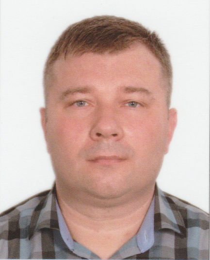

# Резюме 
## **Даниленко Александр Анатольевич** — 
### Мужчина, 43 года, родился 21 июня 1978

#### Контакты:
#### +7 (978) 700-80-53
inspcrimea@gmail.com — предпочитаемый способ связи

*Опыт работы:*

Сентябрь 2015 — июнь 2021

5 лет 10 месяцев
ООО «ИТС-Центр»
Новороссийск

***Предыдущая сфера деятельности:***
Услуги для бизнеса. Консалтинговые услуги.
Контроль качества, экспертиза, испытания и сертификация.

***Последняя работа в компании и должность:***

Работа в сюрвейерской компании; Оперативный координатор ООО «ИТС-Центр» (АО «Интертек Рус») в г. Новороссийск и в г. Тамань (мониторинг качества смешения различных партий грузов нефтепродуктов и сжиженных газов). Инспекция грузов на судах и терминалах; Консультирование контрагентов по контролю качества и количества нефтепродуктов и газов.

>Претендующая должность - специалист, разработчик, аналитик.

>Освоенные навыки:
>1. Работа в ОС Windows 7, 8, 10; + МасOS + Linux
>2. Основы Java, программирование в IntellyJ IDEA
>3. Работа в системе контроля версий - GIT
>4. Система Domino/Lotus Notes 6.5 - администрирование + разработка
>5. Пакет офис MS Office 2010 - Word, Excel, Access, Power Point

>На текущий момент: В процессе изучения курса - "Разработчик Андроид"